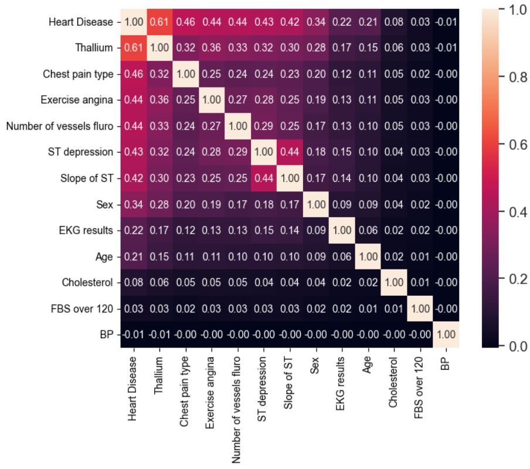

# Предсказание сердечно-сосудистых заболеваний

**Сравнительный анализ более 10 моделей и ансамблей | Прирост +0.202 ROC-AUC**

## Описание задачи
Соревнование Kaggle: https://www.kaggle.com/competitions/playground-series-s6e2/overview 

Бинарная классификация для медицинской диагностики: предсказать наличие сердечно-сосудистого заболевания у пациента на основе медицинских показателей.

**Метрика качества:** ROC-AUC  

## 1. Разведочный анализ данных (EDA)

### 1.2 Анализ категориальных признаков

**Распределение категорий:**
- Категориальные признаки имеют неравномерное распределение 
- Использовано one-hot кодирование

### 1.3 Анализ числовых признаков

- **Возраст (Age):** распределение близко к нормальному, основные пациенты 45-65 лет. выбросов практически нет.
- **Холестерин (Cholesterol):** распределение скошено влево, есть пациенты с очень высоким холестерином (>400).
- **Максимальный пульс (MaxHR):** распределение близко к нормальному, небольшой правый скос (пациенты с высоким пульсом).
- **ST depression:** распределение сильно скошено влево, большинство значений 0-2, есть выбросы до 6+. Это ожидаемо, так как 0 означает отсутствие патологии. 
- **BP:** распределение немного скошено влево, выбросы есть

**Выбросы несут медицинскую информацию**

### 1.4 Корреляционный анализ

**Корреляция с целевой переменной:**
- Наибольшую корреляцию с заболеванием имеют: Thallinum, Chest pain type, Exercise angina, Number of vless fluro, ST 

**Корреляция признаков между собой <0.4:**

## 2. Базовое моделирование (до Feature Engineering)

### 2.1 Бустинги

| Модель | Accuracy | Recall | ROC-AUC (валидация) | ROC-AUC (Kaggle) |
|--------|----------|--------|---------------------|------------------|
| CatBoost | 0.887 | 0.867 | 0.9550 | **0.95320** |
| XGBoost | 0.888 | 0.868 | 0.9546 | 0.95259 |
| XGBoost (linear) | 0.884 | 0.860 | 0.9521 | - |
| LightGBM | 0.887 | 0.868 | 0.9546 | 0.95263 |

**Ключевые выводы:**
- CatBoost показал наилучший результат на Kaggle (0.95320)
- Все бустинги дают близкое качество (разница < 0.001)
- XGBoost с линейной базой ожидаемо слабее — данные имеют нелинейные зависимости

### 2.2 Простые ансамбли бустингов

| Подход | ROC-AUC (валидация) | ROC-AUC (Kaggle) | Прирост |
|--------|---------------------|------------------|---------|
| Лучший бустинг (CB) | 0.9550 | 0.95320 | - |
| Voting (CB+XGB+LGB) | 0.9546 | 0.95320 | 0 |
| Stacking | 0.9550 | 0.95328 | +0.00008 |

**Вывод:** Ансамблирование бустингов не дало значимого прироста, так как модели сильно коррелируют между собой (корреляция предсказаний > 0.94).

### 2.3 Добавление моделей других типов

Для расширения разнообразия моделей для будущих ансамблей:

| Модель | Accuracy | Recall | ROC-AUC |
|--------|----------|--------|---------|
| Logistic Regression | 0.884 | 0.860 | 0.9522 |
| KNN | 0.879 | 0.860 | 0.9422 |
| Random Forest | 0.885 | 0.864 | 0.9526 |

### 2.4 Оптимизация CatBoost (RandomSearch)

- **Метод:** RandomSearch
- **ROC-AUC на валидации:** 0.95516
- **ROC-AUC на Kaggle:** 0.95338

**Вывод:** оптимизация дала минимальный прирост (+0.00018). 

### 2.5 Блендинг (взвешенное усреднение)

- CatBoost: 0.95516
- LightGBM: 0.95458
- XGBoost: 0.95456
- **Блендинг (веса 0.33, 0.33, 0.33):** 0.95506

**Вывод:** блендинг не улучшил качество.

## 3. Feature Engineering

### 3.1 Анализ ошибок базовой модели

**Распределение ошибок по классам:**
- Ошибки на здоровых (ложная тревога): **55.1%**
- Ошибки на больных (пропуск болезни): **44.9%**

**Вывод:** ошибки модели носят случайный характер.

### 3.2 Создание новых признаков

На основе медицинской логики и EDA были созданы следующие признаки:

#### Числовые признаки

| Название | Формула | Логика |
|----------|---------|--------|
| **puls_norm** | Max HR / Age | Норма максимального пульса относительно возраста. С возрастом максимальный пульс снижается, отклонение от нормы может указывать на патологию. |
| **bp_chol** | BP * Cholesterol / 100 | Нагрузка на сердце: произведение давления и холестерина. Высокие значения → повышенный риск. |
| **st_dispersion** | ST depression * Slope | Дисперсия с учетом наклона ST-сегмента. Комбинация двух признаков, связанных с ишемией. |
| **age_fluro** | Age * Fluoroscopy | Взаимодействие возраста и количества сосудов, видимых при флюорографии. Чем старше пациент и больше пораженных сосудов, тем выше риск. |
| **risk_score** | (BP > 130) + (Cholesterol > 240) + (ST depression > 1) + (Age > 55) | Сумма "плохих" показателей. Чем больше факторов риска, тем выше вероятность болезни. |
| **fluro_severity** | Fluoroscopy (преобразованный в порядковую шкалу) | Чем хуже результат флюорографии, тем выше риск (нелинейная зависимость). |
| **chol_age_adj** | Cholesterol / Age * 100 | Холестерин с поправкой на возраст (нормы холестерина меняются с возрастом). |

#### Бинарные признаки

| Название | Условие | Логика |
|----------|---------|--------|
| **sick_asymptomatic** | (Chest Pain = asymptomatic) & (Resting ECG = normal) & (Exercise Angina = no) | "Болезнь без симптомов" — пациент не чувствует проблем, но они есть. Опасная категория. |
| **ekg_tall_risk** | (Resting ECG = abnormal) & (Thalassemia = fixed/reversable defect) | Плохая ЭКГ + плохой таллиум-тест → почти гарантированная болезнь. |
| **st_tall_risk** | (ST depression > 2) & (Thalassemia = fixed/reversable defect) | Высокая дисперсия + плохой таллиум → тяжелая патология. |

## 4. Моделирование после Feature Engineering

### 4.1 Бустинги 

Обучила 5 моделей градиентного бустинга на обновленных данных:

| Модель | Accuracy | Recall | ROC-AUC (валидация) |
|--------|----------|--------|---------------------|
| CatBoost | 0.8870 | 0.8660 | 0.95501 |
| XGBoost | 0.8865 | 0.8658 | 0.95446 |
| LightGBM | 0.8866 | 0.8669 | 0.95452 |
| GradientBoosting | 0.8858 | 0.8630 | 0.95345 |
| AdaBoost | 0.8833 | 0.8610 | 0.95154 |

**Вывод:** CatBoost сохранил лидерство, но разница с другими бустингами сократилась.

### 4.2 Оптимизация CatBoost (GridSearch)

Провела GridSearch для CatBoost на новых данных:
- **ROC-AUC на валидации:** 0.95519 (прироста нет)
- **ROC-AUC на Kaggle:** 0.95337

**Вывод:** новые признаки не потребовали перенастройки параметров — модель сразу адаптировалась.

### 4.3 AutoML

| Модель | ROC-AUC (валидация) | ROC-AUC (Kaggle) |
|--------|---------------------|------------------|
| CatBoost | 0.95415 | 0.95228 |
| XGBoost | 0.95513 | **0.95536** |
| LightGBM | **0.95520** | **0.95531** |
| HistGB | 0.95477 | 0.95293 |

**Вывод:** AutoML помог **XGBoost и LightGBM** догнать и даже немного обогнать CatBoost. При этом сам CatBoost в AutoML показал результат хуже ручного.

### 4.4 Корреляция моделей и ансамблирование

**Анализ корреляции:**
- Корреляция между всеми моделями осталась очень высокой

**Простое усреднение лучших моделей:**
- ROC-AUC на Kaggle: **0.95343**

**Перебор весов для усреднения:**
- Оптимальные веса: (0.45, 0.45, 0.1, ~0) — фактически ансамбль из XGBoost и LightGBM
- ROC-AUC на Kaggle: **0.95344** (микро-прирост)

### 4.5 Расширение варинатов моделей

Добавила модели других типов для поиска низкокоррелирующих алгоритмов:

| Модель | ROC-AUC (валидация) | Комментарий |
|--------|---------------------|-------------|
| Logistic Regression (полином. признаки) | 0.95291 | |
| Random Forest (GridSearch) | 0.94420 | Сильно хуже бустингов |
| SVM | 0.95253 | |
| SVM (GridSearch) | 0.95253 | Без прироста |
| MLP | 0.95292 | |
| MLP (GridSearch) | 0.95292 | Без прироста |
| Gaussian Process | 0.92881 | Единственная модель с низкой корреляцией |

**Корреляционный анализ:**
- Самая низкая корреляция с другими моделями — у **Gaussian Process** (0.93)
- Остальные модели коррелируют между собой значительно выше

### 4.6 Стекинг

Попробовала различные мета-модели для стекинга:
- Logistic Regression
- Random Forest
- **CalibratedClassifierCV (победитель)**

**Результат стекинга:**
- ROC-AUC на валидации: **0.95532**
- ROC-AUC на Kaggle: **0.95346**

## 5. Финальные результаты

### 5.1 Итоговое сравнение

| Этап | ROC-AUC (Kaggle) | Прирост |
|------|------------------|---------|
| Базовый CatBoost (до FE) | 0.95320 | — |
| После FE (лучшая модель) | **0.95536** (XGBoost) | +0.00216 |
| Ансамбли / Стекинг | 0.95346 | — |

**Главный вывод:** основной прирост дал **feature engineering**, а не ансамблирование.

### 5.2 Итоговый прирост

**Прирост на скрытой тестовой части Kaggle после завершения соревнования: +0.202**

## 6. Общие выводы по проекту

1. **Feature engineering оказался важнее тюнинга моделей** — новые признаки дали прирост +0.00216, в то время как оптимизация гиперпараметров и ансамбли — лишь микро-приросты.

2. **Анализ ошибок перед созданием признаков** помог понять, что модель уже выжала всё из текущих данных, и нужно менять именно признаки.

3. **AutoML помог раскрыть потенциал XGBoost и LightGBM** — они догнали и обогнали CatBoost, который был лидером на первом этапе.

4. **Корреляция моделей осталась высокой** — значит, данные имеют сильную структуру, и разные алгоритмы "видят" её одинаково.

5. **Самый большой прирост дали признаки, основанные на медицинской логике** (`puls_norm`, `sick_asymptomatic`, `risk_score`), а не просто математические комбинации.

6. **Финальный результат:** улучшение на **+0.202 ROC-AUC** относительно baseline на скрытой тестовой выборке.

## 7. Использованные технологии

- **Python:** pandas, numpy, matplotlib, seaborn
- **Модели:** scikit-learn, XGBoost, CatBoost, LightGBM, AutoML
- **Оптимизация:** GridSearchCV, RandomSearchCV
- **Ансамбли:** VotingClassifier, StackingClassifier, Blending
- **Инструменты:** Jupyter Notebook, Git, Kaggle

